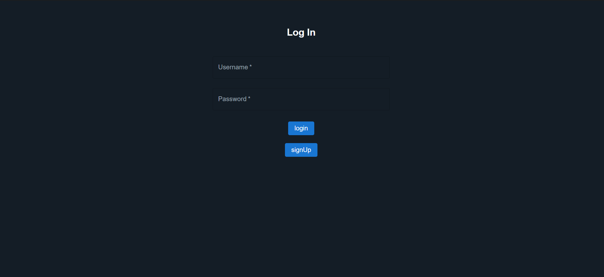
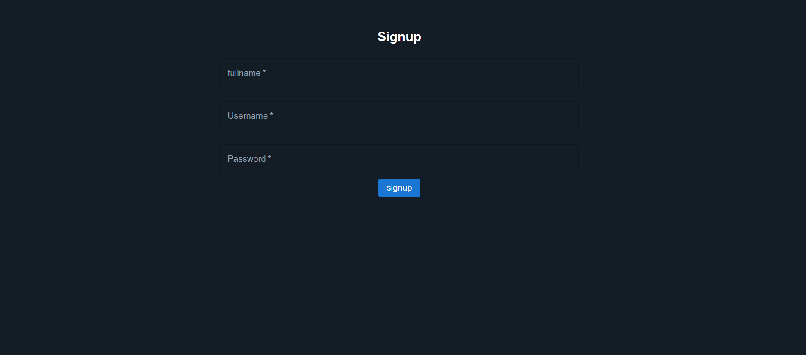
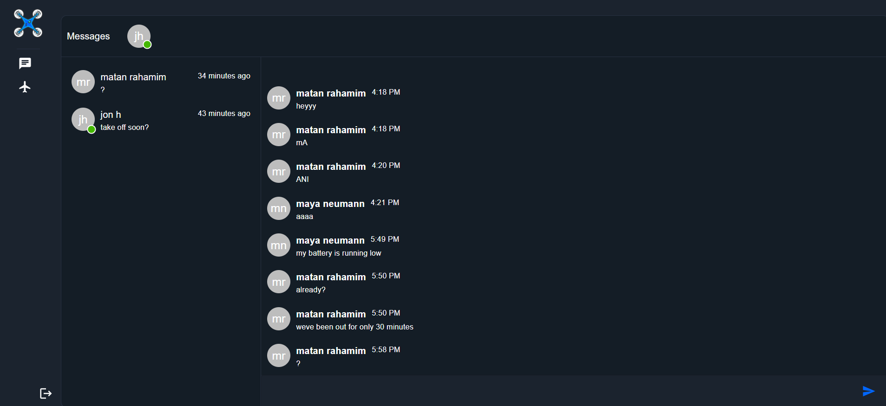
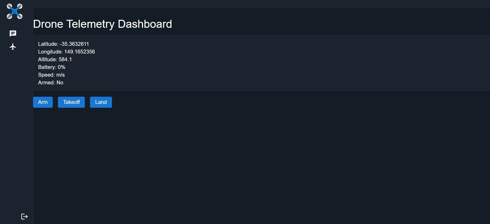

# SkyChat

**SkyChat** is a platform designed for glider pilots in sambusak hovercraft, facilitating communication through a specialized chat interface and providing real-time telemetry via a drone dashboard. This solution is crafted to minimize the actions required by users, allowing them to focus on their flight and communication.

## Features

### The Chat
- **Real-time Communication**: Built with WebSocket for live interaction.
- **User Authentication**: Supports signup, signin, and logout functionalities.
- **Active User Display**: See who's online at a glance.
- **Message Utilities**: Send and receive messages instantly.

### The Drone Dashboard
- **Live Telemetry**: View real-time data from your drone.
- **Command Transmission**: Send commands to your drone directly through the interface.
- **WebSocket Integration**: Ensures that all telemetry data is up-to-date and transmitted in real-time.
- **Pymavlink**: Utilizes pymavlink for effective communication with drones.

login


signup


chat


drone dashboard


## Roadmap for Future Enhancements

Given more development time, several features and improvements are planned:

- **WebSocket Scaling**: Integrate Redis to manage socket connections across multiple pods in environments like OpenShift, addressing statefulness issues.
- **Enhanced Security**: Shift from localStorage to server-side storage using cookies for JWT and refresh tokens.
- **Data Management**: Implement pagination for efficient data fetching.
- **Read Receipts**: Add message read/unread status to enhance user communication.
- **Group Messaging**: Enable users to create and communicate within groups.
- **Quick Messages**: Allow sending of common phrases through one-click actions.
- **Advanced Drone Dashboard**: Redesign the dashboard to provide more comprehensive drone data.
- **Feedback System**: Implement success and error snackbars for immediate user feedback.

## Setup Instructions

### Prerequisites
- Python installed on your machine.
- MongoDB with replicaset configured.
- `.env` file set up (refer to `example.env` for setup).

### Setup
```bash
cd server
pip install -r requirements.txt
uvicorn main:app --reload

cd ../client
npm i
npm run start